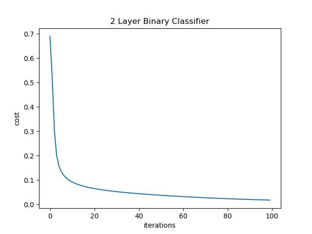
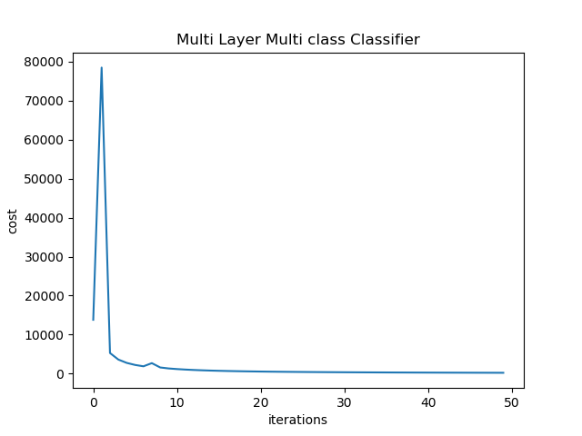

- The data contained 10,000 handwritten digit images from MNIST database.
- Used Cross-validation to train the Deep network.
- Using Neural network classifier we could predict the Handwritten digits with 99% accuracy.

## Two layer neural network for a binary classifier

[link to repository](https://github.com/AchyuthaBharadwaj/Machine-Learning/tree/master/Deep%20Network%20basics)

Dataset: MNIST - digits 2 and 3. <br />
Training a two layer network (1 hidden layer dimension=500) for binary classification. Train with the following parameters. <br />
learning rate = 0.1 <br />
num iterations = 1000 <br />
Filename - twoLayerBinaryClassifier.py <br />
Plot of train error vs iterations;



## Multi-layer neural network for multi-class classifier

[link to repository](https://github.com/AchyuthaBharadwaj/Machine-Learning/tree/master/Deep%20Network%20basics)

Dataset: MNIST - digits 0 to 9 <br />
Training a multi-layer neural network to classify MNIST. The MNIST dataset has 60,000 images which is too large. Therefore, training with just 6000 samples and tested with 1000 samples. <br />
learning rate = 0.1 <br />
num iterations = 1000 <br />
Filename - deepMultiClassClassifierNetwork.py <br />

```javascript
  To create a network with 2 hidden layers of dimensions 800 and 500
    Run the program as:
        python deepMultiClassNetwork starter.py "[784,800,500]"
    The network will have the dimensions [784,800,500,10]
    784 is the input size of digit images (28pix x 28pix = 784)
    10 is the number of digits
```

Plot of train error vs iterations;


