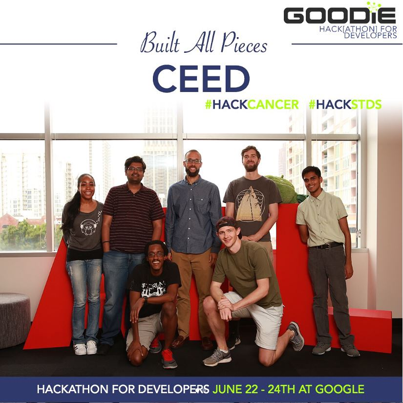
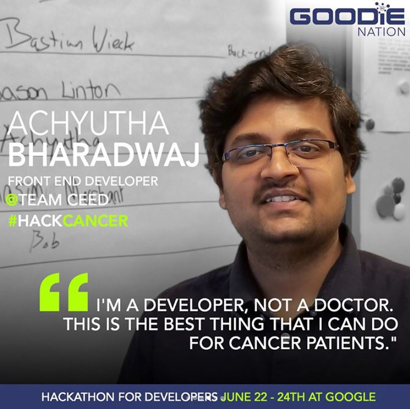
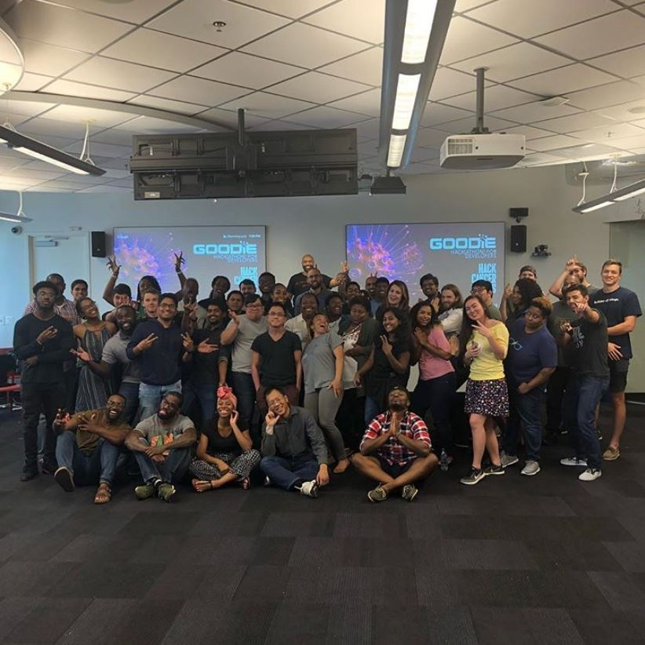

This Hackathon For Developers, was a 48 hour experience where developers, web designers, and product managers donate their talent, and join the teams of these founders in an effort to turn their clickable prototypes that combat cancer into working products. The goal was to help those impacted by cancer, and possibly win money and other prizes. It’s a mashup of social good, tech, entrepreneurship and highly-skilled people, and, quite possibly, the coolest community service project that I have ever experienced.

## CEED

CEED is a social network we developed for cancer patients to interact and keep track of their medicines, diet, exercises, etc.

With Two days of intense effort from all our team members, we were able to completely build a prototype of a social network and present it on the final day. We designed and developed the UI, the backend ASP .NET code and the Web APIs.

CEED was awarded "Built All Pieces of the Product" award.

After the hackathon concluded, I was interviewed about my motivation for Volunteering and how my experience was. This was posted on #GoodieNation 's instagram page.

Finally, I had a great time and a sense of pride and contentment of Giving back to the community. It was an awesome experience. #groupselfietime

Cheers!!!
