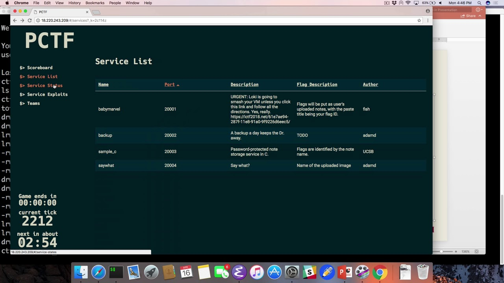

## Attack/Defense CTFs

A key part of studying security is putting our skills to the test in practice. Hacking challenges known as Capture The Flag (CTF) competitions are a great way to do this. CTF is a special kind of information security competition or training. There are two main types of Capture the Flag events:

- Jeopardy
- Attack/Defense.

A Jeopardy-style CTF is providing several tasks or so-called “challenges” in a wide range of computer and network security categories, including Web, Forensic, Crypto, Binary, Reverse Engineering, Mobile Security, IoT, Secure Programming. Teams are not playing against each others. The more challenges they solve, the more difficult tasks they do, the better they score in the jeopardy CTF scoreboard.

An Attack/Defense CTF is really spicing up the jeopardy style CTF. Every team has its own “vulnerable” servers and services. Teams must attack other teams application while protecting the own from being hacked. Teams must keep their services up and running and must solve additional tasks and achievements in parallel.

## PCTF

[link to repository](https://github.com/AchyuthaBharadwaj/PCTF)

There were over 20 teams participating in this PCTF. Each team was given a Virtual Machine hosted on the same central server. The IP addresses of these team VMs were known to everyone beforehand. The goal was to analyze each service, find the vulnerability, create an exploit, launch the exploit at all the other teams, and patch our service.

The scoring system was setup in such a way that it would periodically try to attack other teams VM with our exploit script and for each successful exploit we would be awarded points and at the same time it would deduct points if our VM was exploited by some other team.

The first thing we did was add loggers to our services which would log each incoming request before processing it. So that even if our system was exploited, we can find out which kind of exploit was used and probably fix it. We can also use this as exploit against other teams as well. Next we split our team into two parts, the first would find the vulnerabilities in our system and create exploits for it to use against other teams. The other was responsible for patching these vulnerabilities in our system.

Although we did not win the contest, we had a great time and really enjoyed the CTF. It was both, fun and educational . Awesome.
