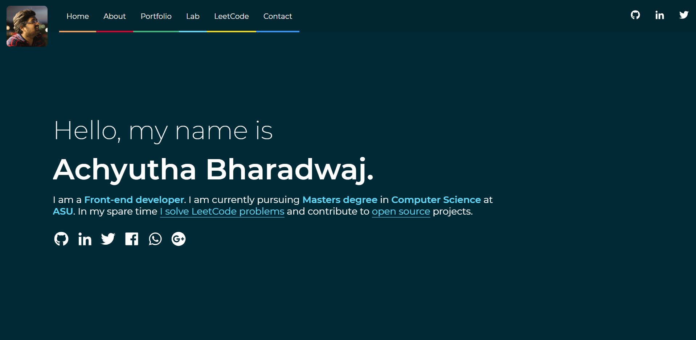

My superfast personal site built using ReactJs / Gatsbyjs - Project written in GatsbyJs and hosted on Netlify. The code is fully Open Source under MIT license.

live: https://portfolio-ab.netlify.com/

Repository: https://github.com/AchyuthaBharadwaj/portfolio-ab

