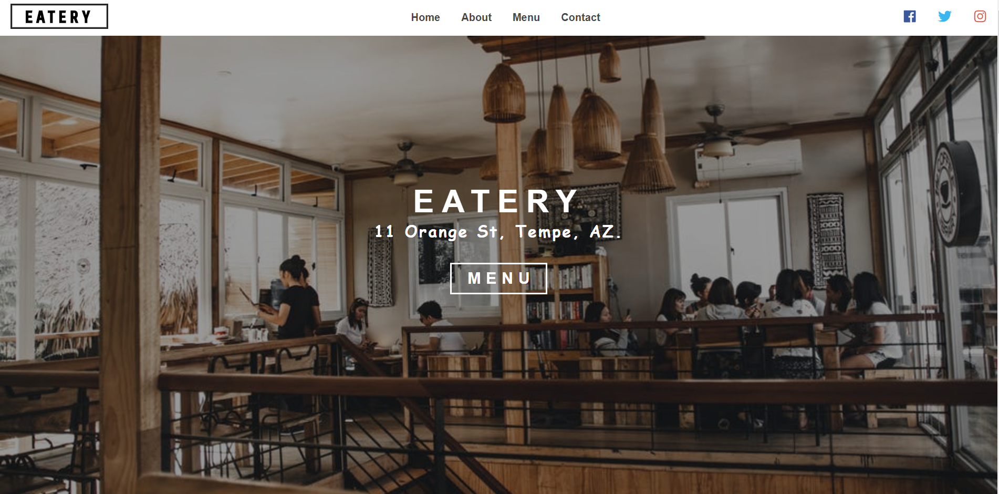

Superfast full responsive restaurant landing page - Project written in GatsbyJs and hosted on Netlify. The code is fully Open Source under MIT license.

live: https://restaurant-ab.netlify.com/

Repository: https://github.com/AchyuthaBharadwaj/restaurant-ab

