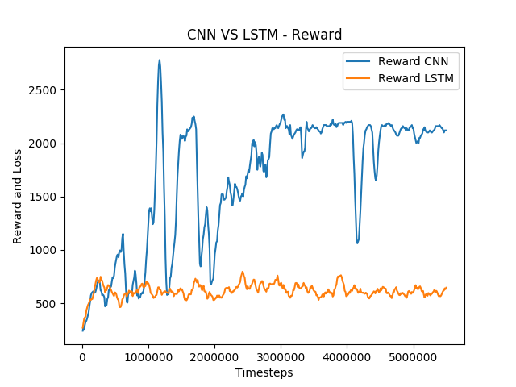

### Goals:

- Comparing the algorithm performance with other baseline techniques for OpenAI game environment
- Exploring performance based on input data preprocessing , using different Neural Network architectures & CPU vs GPU training
- Modifying different hyperparameters to analyze their impact on the overall performance of the algorithm

[link to repository](https://github.com/AchyuthaBharadwaj/PPO)

### Implementation:

- The model is developed using TensorFlow and input data is collected from OpenAI GYM's MS-PACMAN environment.
- Performance of different neural network architectures is explored:
  "CNN vs LSTM - Reward function"
  

- GPU based training was done using Google Collaboratory
- Reference : OpenAI GYM Baselines

### Output:

Different models based on the modified hyperparemeters, CPU training & GPU training. Performance comparison(rewards & loss function) plots.
