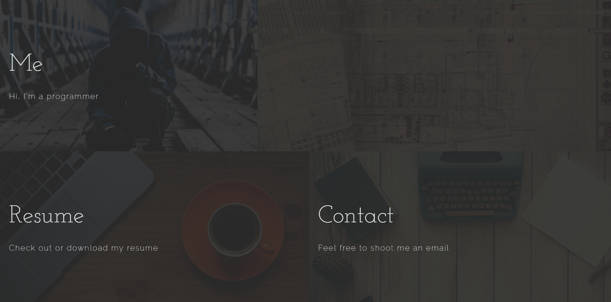
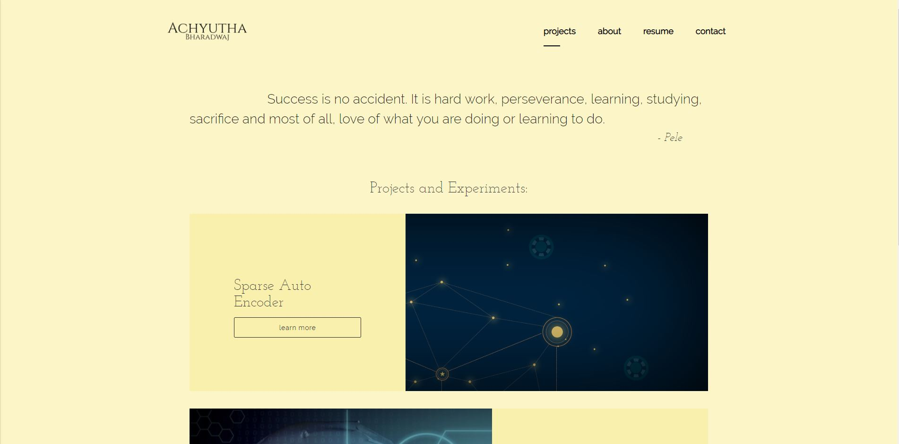
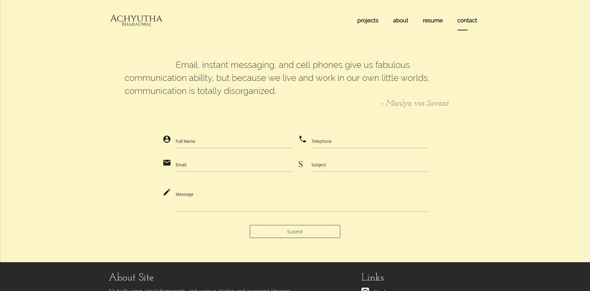

A personal Portfolio is very important to Students like me who are searching for carrer opportunities. I have built my Portfolio inspired by **Levytsroman's** portfolio. Here are some snapshots,

Live: [https://achyuthabharadwaj.github.io/Portfolio](https://achyuthabharadwaj.github.io/Portfolio)

[link to repository](https://github.com/AchyuthaBharadwaj/Portfolio)

- The Landing page
  

- The Resume page
  

- The Project page
  

- The Contact page
  

The main technologies used are: Jekyll, HTML, CSS, Javascript.

## How to customize

Most of the content of the site comes from the \_data folder.

The website is designed to have 4 sections if you want to change what they are, modify the sections.yml file inside \_data folder. If you do change the sections, make sure not to change the class property, as css file rely on them being called a cetain way.

To update projects modify the projects.yml, you can add your own tags and later reference them in \_includes/project_box by putting {{project.your_tag}} in the html.

If you want to use the form in the contact page, you'll need to make an account with https://formspree.io/. Then simply update the email in the \_config.yml to whatever you used to register.

For more info on how to use jekyll visit https://jekyllrb.com/docs/home/
