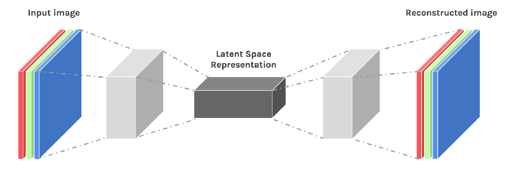
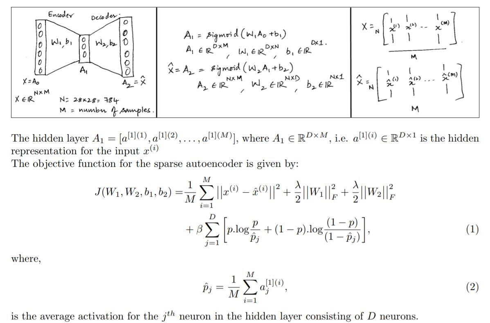
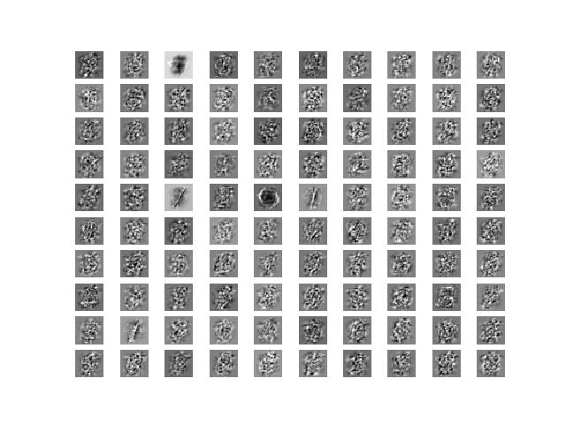
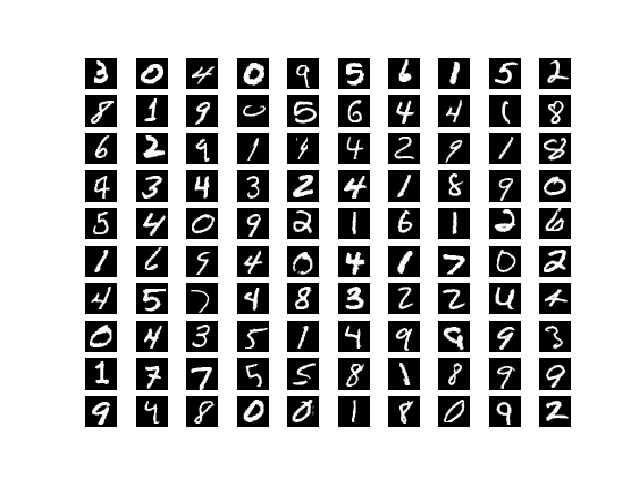
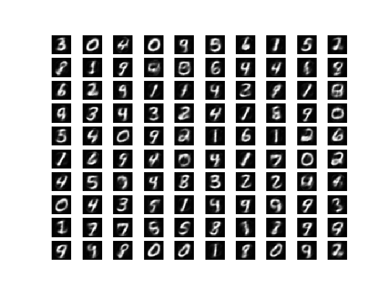

## Semi Supervised Learning Using Sparse Autoencoder



### Goals:

- To implement a sparse autoencoder for MNIST dataset. Plot a mosaic of the first 100 rows for the weight matrices W1 for different sparsities p = [0.01, 0.1, 0.5, 0.8] .
- Using the same architecutre, train a model for sparsity = 0.1 using 1000 images from MNIST dataset - 100 for each digit. Retrain the encoder output representation of the data with a softmax layer for the 1000 labeled points. Plug original data, encoding and softmax layers together and fine-tune the model.
- Compare performance with a generic neural network of same layers where the weights are initialized randomly for the remaining dataset which is considered to be unlabelled.

[link to repository](https://github.com/AchyuthaBharadwaj/Machine-Learning/tree/master/Sparse%20Auto%20Encoder)

```javascript
    Dataset: MNIST - All the digits
    Autoencoder parameters:
        Num of hidden layers: 1
        hidden layer Size = 200
        max iterations = 400
        Sparsity parameter p = [0.01, 0.1, 0.5, 0.8]
        Weight decay λ = 0.001
        Sparsity coefficient β = 3
```

### Implementation:

The the architecture and cost function is as follows
sparse encoder model



The model is developed using TensorFlow. The weight matrix mosiac for a given sparsity value is as follows

- Weight matrix mosiac
  

- Original image
  

- The regenerated image
  

For semi supervised learning the same tensorflow model was used for initial training. Subsequent implementation of generiac neural network model and training of encoder-softmax & fine-tuning of input-encoder-softmax model was done using keras.

Since the already generated weights were requried to be reused during fine-tuning, an custom initializer class was implemented to pass them to the keras neural network layers.

### Output:

Weight matrix and regenerated input mosiacs for different sparsity values Performance comparison between generic neural network and the fine-tuned model obtained using encoder
