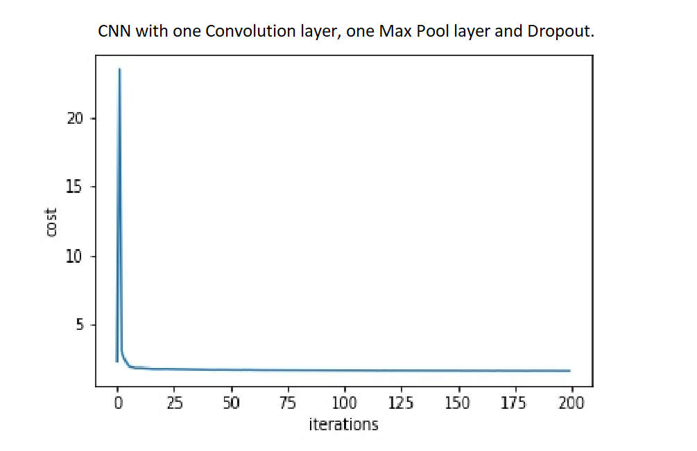

In this project I implemented neural networks with convolutional, pooling and the dropout layers.

## Neural network with one convolutional layer, one pooling layer and dropout

[link to repository](https://github.com/AchyuthaBharadwaj/Machine-Learning/tree/master/CNN)

To understand the nut and bolts of how a traditional Convolution Neural Network works, I built a CNN from scratch. Used 10 filters in the convolutional layer, each of them are 3 × 3 size patches with stride 1. Added a max pooling layer after the convolutional layer with 2 × 2 pooling and stride 1. And lastly, a fully connected hidden layer with 50% dropout for updating the weights. Since the number of filters was less, the accuracy was moderate, but it still gave me a great understanding toward how CNN architectures work. 

